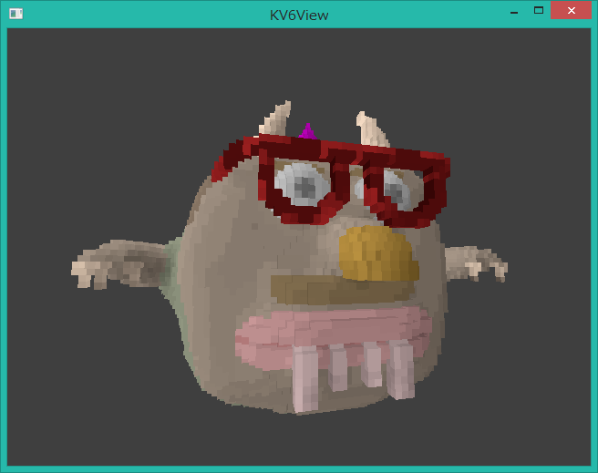

# kv6view-rs

this has no support for changing sensitivity or anything as of yet, it's just a silly tool i threw together in a day for fun

for now, the "configuration" is just hardcoded in `src/controls.rs`

## compiling and running

as simple as `cargo run -- <file>` :)

## other stuff

thanks to mat^2 (Mathias Kaerlev) for the... uh, *inspiration*
<https://code.google.com/archive/p/kv6view/>

thanks to Ken Silverman for KV6, VOXLAP, and caco.kv6 as shown in the image :)

also kv6.rs is dirty don't look in there